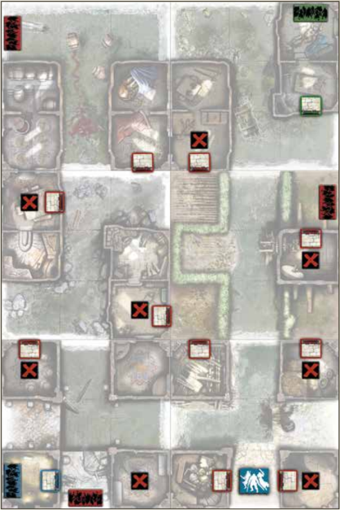

+++
title = "Missão 5: Abrigo pálido"
tags = ["quests", "green-horde", "friends-and-foes"]
draft = false
quest_difficult = "medium"
quest_survivors = 6
quest_minutes = 60
+++

Estamos em uma situação complicada. Nosso abrigo mais recente não pode nos proteger muito mais tempo, e ainda não encontramos outro adequado. Está frio, a chuva continua caindo, e uma lua pálida já está aparecendo no céu.

Este vilarejo em uma estrada comercial é nosso último recurso. Já estivemos aqui antes, e lembramos de duas construções reforçadas no lugar. Nosso próximo abrigo pode muito bem estar cheio de monstros infectados. Vamos abrir aquelas portas e descobrir. Vamos limpar o lugar se não houver outra opção. Meu reino por uma fogueira e calças secas!

> Material necessário: Zombicide: Green Horde, Friends And Foes.

> Mapas necessários: 17R, 18R, 20V, 21R, 22R e 23R.

## Objetivos
Chegue até a Zona de Entrada azul e/ou verde com todos os Sobreviventes iniciais. Qualquer Sobrevivente pode escapar por qualquer uma dessas Zonas no final de seu turno, desde que não haja Zumbis nela.

## Regras Especiais
- Preparação. Coloque aleatoriamente as fichas de Objetivo azul e verde entre as fichas de objetivo vermelhas, voltadas para baixo.
- O Mal Abaixo. Cada ficha de Objetivo concede 5 pontos de experiência para o Sobrevivente que a pegar.
    - A porta azul não pode ser aberta enquanto a ficha de Objetivo azul não for pega. A Zona de Entrada azul se torna ativa no momento que a ficha de Objetivo azul é pega.
    - A porta verde não pode ser aberta enquanto a ficha de Objetivo verde não for pega. A Zona de Entrada verde se torna ativa no momento que a ficha de Objetivo verde é pega.
- Prisões Infectadas. As fichas de Entrada de Zumbis azul e verde não podem ser removidas.
