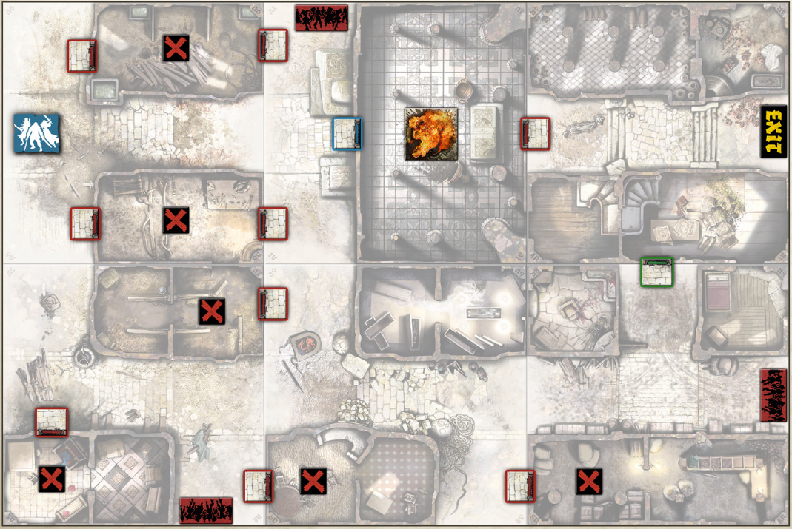
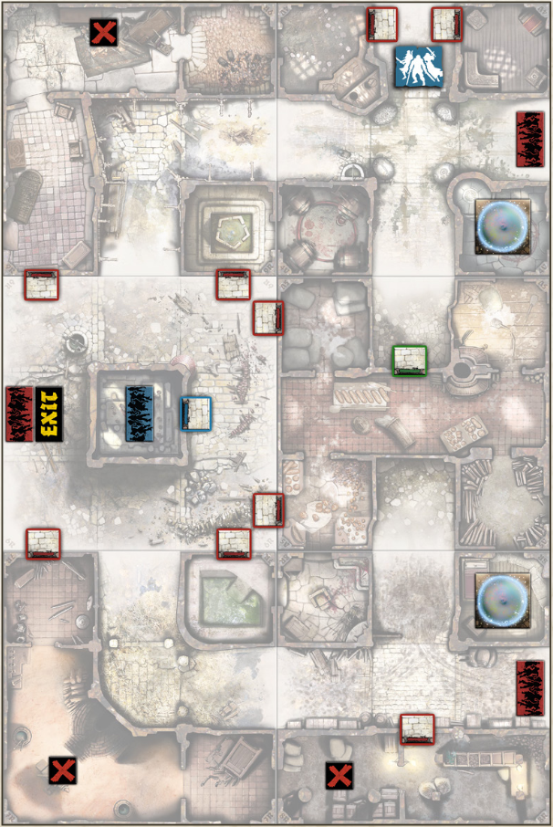
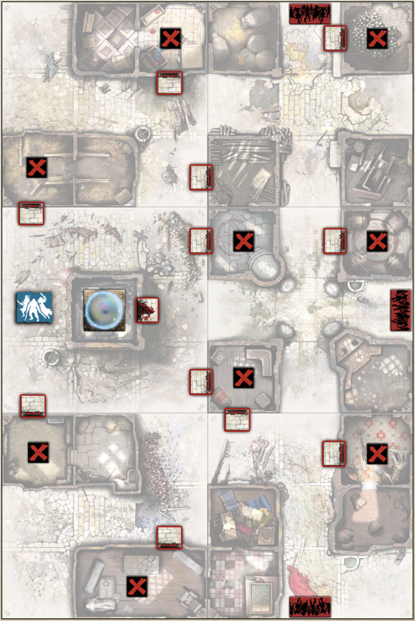
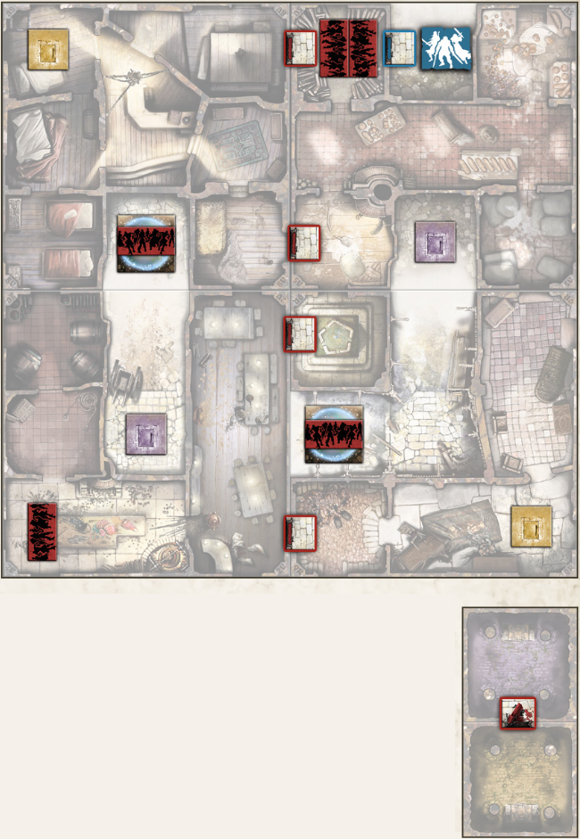
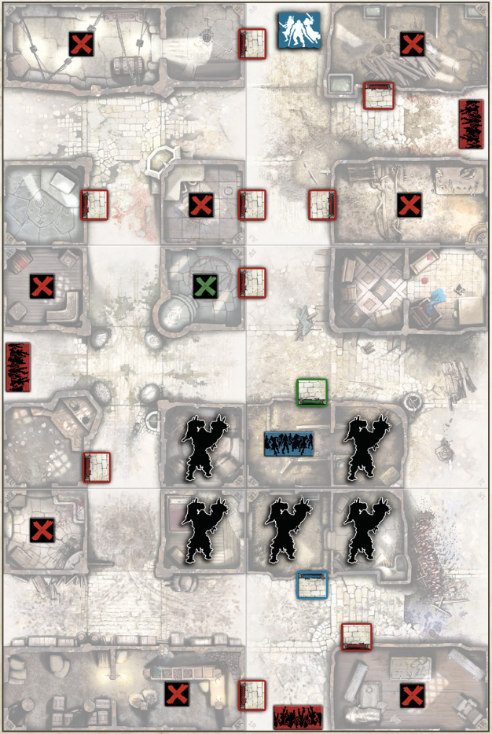

+++
title = "Campanha: Lugares de interesse"
tags = ["campaigns", "black-plague"]
draft = false
quest_difficult = "very hard"
quest_survivors = 6
quest_minutes = 60
+++

> Créditos pela tradução: Gustavo Lopes

*Alguns lugares na região ficaram desertos desde que os zumbis vieram. Ninguém vai até lá, nunca. Na maior parte do tepo estes lugares atraem muita atenção dos necromantes ou se tornaram moradia para monstros furiosos ou estão fortemente barricados. Aquilo que mantém as pessoas comuns longe é terrivelmente tentador para os sobreviventes. portanto chegou a hora de fazer um tour por estes "lugares de interesse" e ver o que podemos encontrar por lá: tesouros escondidos, um bom zombicídio, ou ambos, e muita diversão. Preparado?*

## Regras da campanha

### De um lugar para outro
Escolha uma Missão para começar. O *Templo do Fogo* é um bom começo, pois uma vitória facilita a próxima Missão!

As Missões podem ser jogadas em qualquer ordem, entretan a mesma Missão não pode ser jogada duas vezes seguidas.

A campanha acaba assim que os jogadores vencerem as cinco diferentes Missões. Lugares de Interesse é uma campanha nível expert. Você enfrentará um desafio real e horas de diversão cooperativa. Será você um dos pooucos felizardos à visitar todos os locais descritos na campanha e sobreviver?

> *Lugares de Interesse* é uma campanha de 5 Missões criada para o Kickstarter do *Zombicide: Black Plague* em 2015. Foi desenhada incluindo todos os extras da campanha, portanto é recomendado possuir Zumbis extras (incluindo Abominações extras).

### Recompensas da missão
Cada missão dá direito a recompensas especiais na forma de bônus para serem usados uma única vez. A Missão descreve seu efeito no jogo. O sobrevivente pode guardar estes bônus de uma Missão para outra até o fim da campanha, porém uma vez utilizado, ele é consumido. Estes bônus podem ser ganhados de volta ao jogar novamente a Missão relacionada.

### Recompensa vermelha
Qualquer sobrevivente que alcançar o Nível Vermelho ao fim de uma Missão terminada com sucesso pode começar a próxima com uma arma de Cripta da escolha do jogador. Se não houver mais armas de Cripta para todos os Sobreviventes, os jogadores podem escolher distribuir Armas de Cripta entre os Sobreviventes.

> Mas e se...
> - Um Sobrevivente morreu? Sobreviventes são difíceis de matar. O sobrevivente começa a próxima Missão com um Ferimento.
> - Um Sobrevivente foi ferito ao final de uma Missão? É apenas um ferimento superficial. O Sobrevivente é completamente curado.

## Missões

### Missão 1: O templo do fogo
- Médio
- 4 sobreviventes
- 180 minutos

*Um Deus do fogo era adorado neste vilarejo remoto. Eu me lembro de rumores dizendo que seus sacerdotes conseguiam cuspir fogo. Eu não conheci nenhum, o que é uma pena; aquilo poderia ser muito ítil, contra uma Abominação, por exemplo.*

*Infelizmente, o templo está fechado e trancado. Vamos procurar a chave e limpar este lugar - Eu conheço um ritual. Afinal, nós não queremos encontrar nenhum zumbi cuspidor de fogo, queremos?*

> Mapas necessários: 1V, 3V, 4R, 6V, 8R & 9V.

#### Objetivos
1. **Entre no templo e o purifique**. Você precisa encontrar uma chave azul ou uma chave verde para entrar. O templo será purificado assim que não houver Zumbis em todo o prédio contendo a ficha de fogo.
2. **Faça o ritual.** Passe pela Zona contendo a ficha de fogo até receber a Benção de Fogo (veja Regras Especiais).
3. **Fuja.** Chegue até a Zona de Saída com todos os Sobreviventes. Qualquer Sobrevivente pode escapar por esta Zona no final de seu turno desde que não haja Zumbis nela. 

#### Regras especiais
- **Preparação.** Coloque os Objetivos azul e verde aleatoriamente entre os Objetivos vermelhos, com a face virada para baixo.
- **Souvenirs para os Sobreviventes.** Cada Objetivo concede 5 pontos de experiência para o Sobrevivente que o pegar.
- **Fechado e trancado.** A porta azul não pode ser aberta até que o Objetivo azul seja pego. Aporta verde não pode ser aberta até que o Objetivo verde seja pego.
- **O deus do fogo está nervoso.** Qualquer Agente que começar sua Ativação na Zona com a ficha de fogo ativa um efeito de Fogo de Dragão na zona. Zumbis eliminados por este método não garantem pontos de experiência.
- **A benção de Fogo.** Depois que o templo for purificado, role um dado sempre que um Sobrevivente passaar pela Zona com a ficha de fogo. Caso o resultado seja Par, nada acontece. Caso o resultado seja ímpar, o Sobrevivente recebe a Benção de Fogo como bônus para uso único. Um sobrevivente não pode ter mais do que uma Benção do Fogo por vez. O Sobrevivente pode gastar uma Ação para usá-la> ela cria um efeito de Fogo de Dragão na Distância 0-1 e dentro da Linha de Visão do Sobrevivente. Adicionalmente, este Fogo de Dragão não ageta seu criador!

### Missão 2: taverna crânios & ossos
- Muito difícil
- 4+ sobreviventes
- 180 minutos

*Apenas o nome do local é suficiente para que façamos uma visita. Se não era covil de um necromante antes dos zumbis, agora é. Nós exploramos a àrea e descobrimos que um ritual está em curso. Isso não pode ser bom. Nó temos que por um fim nisso.*

> Mapas necessários: 4V, 5V, 6R, 7R, 8R & 9R.

#### Objetivos
1. **Entre na taverna Crânios & Ossos e pare ambos os rituais.**
2. **Fuja.** Chegue até a Zona de Saída com todos os Sobreviventes. Qualquer sobrevivente pode escapar por esta Zona no final de seu turno desde que não haja Zumbis nela.

#### Regras especiais
- **Preparação.**
    - Coloque o Objetivo verde aleatoriamente entre os Objetivos vermelhos, com a face virada para baixo.
    - Separe todas as Cartas de Entrada para no mínimo 3 Abominações extras (Abominalpha, Abominarat, etc.). Estas cartas constituem o baralho de Abominações. As cartas de Entrada para Abominações normais se mantem no baralho de Zumbis.
- **Inesperado e bem-vindo.** Cada Objetivo concede 5 pontos de experiência para o Sobrevivente que o pegar.
- **Reforços do Necromante.** A ficha de entrada de Zumbis azul se mantèm inativa atpe que a porta azul seja aberta. A porta azul pode ser aberta como uma porta comum. Ela tambpem se abre sozinha na primeira vez que um Necromante entrar no tabuleiro.
- **Porta dos fundos fechada.** A porta verde não pode ser aberta até que o Objetivo verde seja pego.
- **Não é um ritual, é uma armadilha.** Quando um Sobrevivente entrar na Zona de barreira mágica, remova a ficha e sorteie uma carta do baralho de Abominações. Faça a entrada de Zumbis correspondente na Zona de sobrevivente que desativou a barreira.
- **Recompensas.** Sobreviventes que fugirem sem nenhum Ferimento recebem um bônus para uso único: Regeneração Instantânea. Um Sobrevivente pode usá-lo a qualquer momento durante sua Ativação (mas não durante a resolução de uma Ação) para recuperar todos os seus Ferimentos.

### Missão 3: Ao longo do campanário
- Muito difícil
- 4 sobreviventes
- 180 minutos

*As vezes é difícil dizer quando uma atitude é heróica, estúpida, ou ambos. Este é o caso aqui, alguém de alguma forma, conseguiu prender várias Abominações no campanário da cidade. Nós já ouvimos falar de uma Abominação presa em um local fechado, mas várias? Isso é inacreditável.*

*Isso também é lamentável, já que necromantes continuam aparecendo com suas hordas para libertar essas bestas. Isto está ficando chato, e nós temos que dar um fim nisto.*

*Portanto, hoje nós vamos fazer um zumbicídio. Apenas não pense demais nas Abominações. Hey, eu acho que descobri uma forma de ser o herói!*

> Mapas necessários: 1R, 2R, 3V, 4V, 6R & 7V

#### Objetivos
**Mate todas as Abominações.** Você vence o jogo assim que o baralho de Abominações estiver esgotado (ver Regras Especiais) e não houver Abominações no tabuleiro.

#### Regras especiais
- **Preparação.**
    - Coloque o Objetivo azul aleatoriamente entre os Objetivos vermelhos, com a face virada para baixo.
    - Separe todas as Cartas de Entrada para no mínimo 3 Abominações extras (Abominalpha, Abominarat, etc.). Estas cartas constituem o bvaralho de Abominações. As Cartas de Entrada para Abominações normais se mantem no baralho de Zumbis.
- **Isto parece divertido!** Cada Objetivo concede 5 pontos de experiência para o Sobrevivente que o pegou.
- **Palavras chave para o ritual da barreira mágica.** NÃO LEIA... Tarde demais. Quando o Objetivo azul for pego, a Zona da barreira mágica começa a invocar Abominações. Use-a como uma Zona de Entrada de Zumbis regular, mas sorteie do baralho de Abominações. O baralho não é reembaralhado quando acabarem as cartas.
- **Recompensas!** Sobreviventes que mataram uma Abominação recebem um bônus para uso único no fim da Missão> Amuleto Encouraçado. Um Sobrevivente pode usá-lo a qualquer momento (mas não durante a resolução de uma Ação) para receber a habilidade Encouraçado até o fim da próxima Fase Final.

### Missão 4: Fortaleza
- Difícil
- 4+ sobreviventes
- 180 minutos

*Nós avistamos esta fortaleza a quilometros de distância. Sua entrada gigantesca está barricada, e alguém conseguiu pregar um aviso na porta de madeira: "Entre e morra". Encantador.*

*Quem selou este lugar? O que tem dentro? Somos curiosos e estúpidos o suficiente para entrar e descobrir por nós mesmos? Eu tenho uma resposta: sim, nós somos.*

*Um zumbido constante e cheiro de enxogre você diz? Não se preocupe. Tudo vai ficar bem. Eu tenho certeza.*

> Mapas necessários: 2V, 5V, 8V & 9R.

#### Objetivos
**Mate aquilo que está atrás das barreiras mágicas.** Você vence assim que ambas as barreiras mágicas forem destruídas e não houver mais Zumbis nas Zonas de Rua.

#### Regras especiais
- **Fontes de Morte.** Durante a Etapa de Entrada de Zumbis, não olhe as cartas sorteadas para as Zonas de Entrada de Zumbis dentro das barreiras mágicas. Guarde-as embaixo de suas respectivas barreiras mágicas.
- **O zumbido parou!** Quando um Sobrevivente abrir a porta de Cripta violeta:
    - Remova a ficha de barreira mágica da rua correspondente à porta de Cripta violeta.
    - Revele as cartas de Entrada de Zumbis empilhadas na Zona de Entrada de Zumbis, uma após a outra, e coloque os Zumbis correspondentes. Cartas de Entrada Dupla se aplicam à esta Zona.
- **Necromantes passando.** Necromantes estão familiarizados com a fortaleza e podem usar as portas de Cripta. Qualquer Necromante que fizer uma ativação em uma Zona com uma porta de Cripta gasta uma Ação para abri-la, ignorando qualquer Sobrevivente na mesma Zona.
- **Chaves perdidas.** Portas padrão não podem ser abertas. A porta azul e as portas de Cripta podem ser abertas como portas comuns.
- **É uma cripta!** Ambas as Criptas estão ligadas por uma porta aberta.
- **Recompensas!** Qualquer Sobrevivente que abriu uma porta de Cripta a partir de uma Zona de Rua recebe a ficha de barreira mágica ao fim da Missão. Este é um bônus para uso único: o Sobrevivente pode usá-lo a qualquer momento (mas não durante a resolução de uma Ação) para colocar uma ficha de barreira mágica em uma Zona de Entrada de Zumbis dentro de sua Linha de Visão. Qualquer carta de Zumbi sorteada para a Zona de Entrada de Zumbis selada é colocada embaixo da ficha, com a face virada para baixo e sem revelá-la. Assim que o total de cartas chegar a dois, interrompa a Etapa de Entrada de Zumbis. Revele as cartas de Entrada de Zumbi uma por uma, fazendo a entrada correspondente de Zumbis para cada uma delas. Entradas Duplas se aplicam para apenas a Zona de Entrada de Zumbis atual. Depois, continue a Etapa de Entrada de Zumbis.

### Missão 5: A âncora negra
- Muito difícil
- 4+ sobreviventes
- 180 minutos

*Necromantes parecem usar este lugar para guardar seus mais terríveis asseclas: as Abominações. Elas estão aqui, esperando por seu mestre. Com algum tipo de magia negra, necromantes conseguiram paralisar. estes monstros. Elas não se movem mesmo sentindo nossa presença no local. Esta pode ser uma boa hora para causar um dano considerável. Qualquer coisa que possa irritar os necromances vale a pena o esforço.*

> Mapas necessários: 1R, 3V, 4V, 5R, 8R & 9V

#### Objetivos
**Mate as Abominações.** Você vence o jogo assim que todas as Abominações forem eliminadas.

#### Regras especiais
- **Preparação**.
    - Coloque o Objetivo azul aleatoriamente entre os Objetivos vermelhos, com a face virada para baixo.
    - Coloque 5 Abominações (de sua escolha) nas Zonas marcadas.
- **Portas seladas.** A porta azul não pode ser aberta até que o Objetivo azul seja pego. A porta verde não pode ser aberta até que o Objetivo verde seja pego.
- **Os necromantes têm a chave verde.** Se um Necromante for ativado em frente à porta verde, ele gasta sua Ação para abri-la, ignorando qualquer Sobrevivente na Zona.
- **Parado!** Esse é o meu garoto. Abominações não se movem a menos que uma das portas que dão acesso a elas esteja aberta.
- **Pistas para outros locais.** Cada Objetivo concede 5 pontos de experiência ao Sobrevivente que o pegou.
- **Âncora Negra.** A Zona de Entrada de Zumbis azul é ativada assim que um Necromante for sorteado. Esta Zona não pode ser movida ou removida do jogo, e nenhuma outra Zona de Entrada de Zumbis pode ser colocada nesta Zona. Necromantes que não entraram pela Zona de Entrada de Zumbis azul tentam alcançar a Zona de Entrada de Zumbis azul, não importando o quão distante estejam. Eles entram pela porta verde. Necromantes que entrarem pela Zona de Entrada de Zumbis azul agem normalmente.
- **Recompensas!** Sobreviventes que mataram uma Abominação recebem um bônus para uso único ao final da Missão: +1 de Dano ao realizar uma Ação de Combate envolvendo uma Abominação. Este bônus pode ser usado com qualquer arma após um rolagem de ataque.
