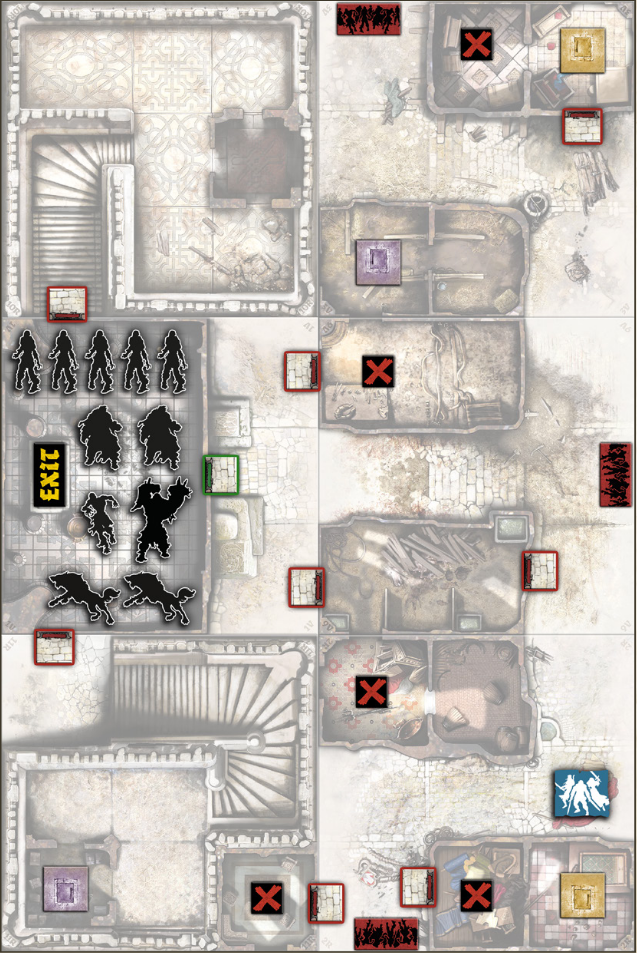
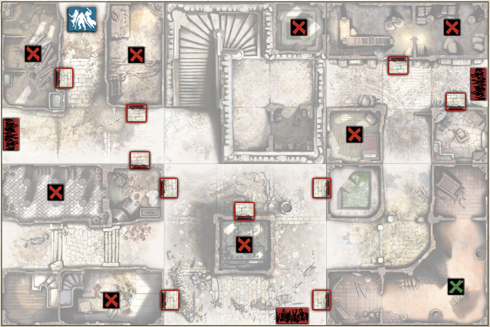
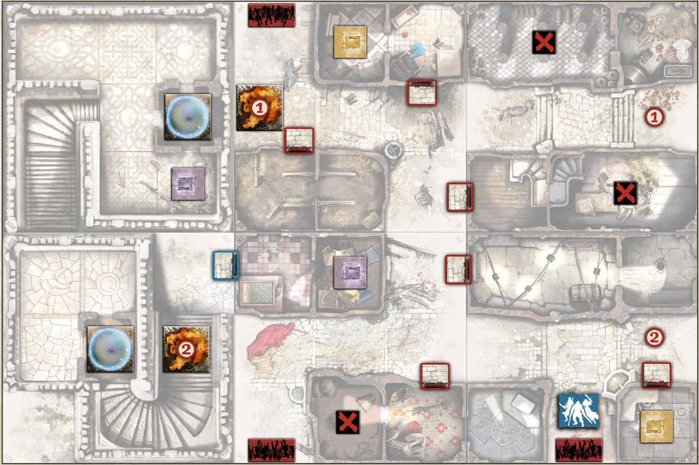
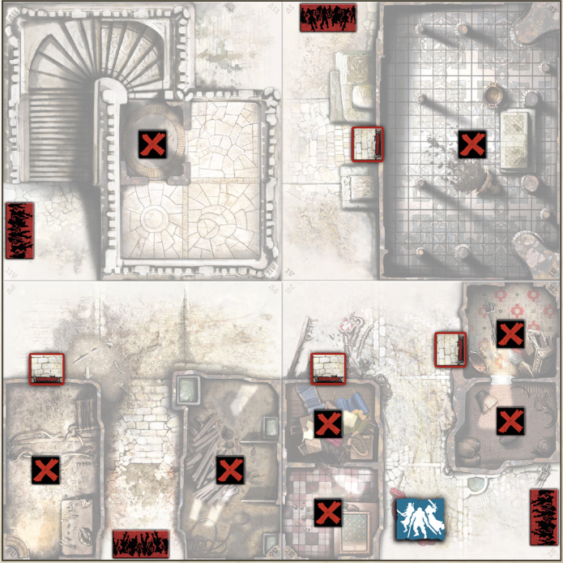
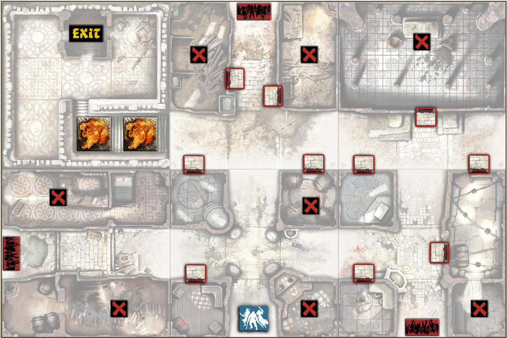

+++
title = "Campanha: Deus do fogo"
tags = ["campaigns", "black-plague", "wulfsburg"]
draft = true
quest_difficult = "very hard"
quest_survivors = 6
quest_minutes = 60
+++

> Créditos pela tradução: Neninja

*Tudo começou quando Padre Tucker teve uma ideia brilhante… ou pelo menos parecia. "Qual a melhor forma de destruir um bando de zumbis?" ele disse. Fogo! O fogo pode destruir até a mais terrível Abominação. Lembra-se do templo de fogo que purificamos nas nossas expedições por lugares esquecidos? Não é exatamente minha paróquia, mas se conseguíssemos uma aliança com o Deus do Fogo para destruir nossos inimigos mútuos, nossa cruzada por Wulfsburg ficaria um pouco mais fácil.*

*Como sempre, o plano não sobreviveu ao primeiro contato com o inimigo. E não foi culpa dos zumbis… deles já sabíamos o que esperar. O problema foi o fogo. Fogo não é um aliado confiável, apenas um inimigo confiável de tudo e todos que puder consumir. Maneje com cuidado.*

> Campanha avançada para Zombicide: Black Plague, criada para o Kickstarter de 2015. Feita para ser jogada com a expansão Wulfsburg.

## Regras da Campanha

### Recompensa Vermelha
Qualquer Sobrevivente que atingir o nível Vermelho ao final de uma missão bem-sucedida pode começar a próxima com uma arma de Cripta de sua escolha. Se houver menos armas de Cripta do que sobreviventes elegíveis, o grupo decide como distribuí-las.

### Um Caminho em Chamas

*O Deus do Fogo* é uma campanha de nível especialista, começando com a missão *"Encontre o Deus do Fogo"*. Cada missão pode terminar de duas formas:

- Sua equipe consegue conter a ira do Deus do Fogo e avança para a próxima missão, conforme indicado nos Objetivos.
- O Deus do Fogo é libertado. Vocês podem tentar realizar a missão "Reprimindo o Fogo" para contê-lo... ou simplesmente deixar que o seu novo "amigo divino" cuide da situação. Claro, os zumbis desaparecerão, mas tudo o que vocês amavam vai virar um monte de cinzas. Este lugar se tornará morte, fim de história.

A campanha se encerra em *"Armageddon"*. Ela pode levá-los de volta à primeira missão, criando uma estrutura de campanha cíclica. Algumas missões também possuem condições que implicam no final definitivo da campanha.

> O Que Acontece Se...
>
> - Um Sobrevivente morrer? Ele inicia a próxima missão com uma Ferida.
> - Sobrevivente terminar ferido? Ele começa a próxima missão totalmente curado.

## Missões

### Missão 1: Encontre o Deus do Fogo
- Difícil
- 6 sobreviventes
- 180 minutos

*Podemos chamar o fogo da atenção de Deus por limpar e libertar um de seus templos. É fácil: mate os zumbis, o necromante ... e talvez lave o chão também. Esse é um plano!*

> Mapas necessários: 1V, 2R, 3V, 9V, 10R e 11R.

### Objetivos
**Libere o templo do Deus do Fogo.**  
Vença quando a Zona do templo (1V) e ambas as torres estiverem livres de zumbis.

- **Sucesso:** Vá para **A Torre do Dragão**.
- **Fracasso:** A campanha falha. Tente novamente.

### Regras especiais
- **Preparação:** Coloque o Objetivo verde aleatoriamente entre os Objetivos vermelhos, com a face para baixo.
- **Porta do templo:** Só pode ser aberta após pegar o Objetivo verde.
- **Desecradores:** Necromantes vão para a Zona de Saída (bandeira) ao invés de uma Zona de Entrada. Se estiverem em frente à porta verde, gastam a próxima ativação para abri-la.
- **Profanação Final:** Se o Necromante chegar na Zona de Saída, ele termina a missão.

### Missão 2: A Torre do Dragão
- Difícil
- 6 sobreviventes
- 120 minutos

*A torre do dragão, um monumento dedicado Para o fogo de Deus, serve dois propósitos. Primeiro, Muitos devotos chegam a este lugar como uma peregrinação a Sinta o poder da divindade. A Torre do Dragão é também uma máquina de guerra defensiva que pode derramar fogo todas as direções, daí seu nome.*

*Desde que alimemos os lançadores da torre com o direito munição, a torre do dragão poderá queimar em todos os zumbis nas proximidades. Não vai demorar muito Antes de o distrito finalmente ficar em paz, virando o santo Coloque em um farol ardente para os sobreviventes.*

> Mapas necessários: 4R, 6R, 7R, 8R, 9V e 11R.

### Objetivos
**Limpeza com fogo!**

1. **Encontre os barris de Dragonsbreath:** Pegue os Objetivos azul e/ou verde.
2. **Queime os zumbis:** Use a Torre do Dragão para remover todos os tokens de Zona de Entrada do tabuleiro.

- **Sucesso:** Se todos os tokens de Entrada forem removidos e houver ao menos 4 Objetivos restantes no tabuleiro, vá para **Os Gêmeos Carmesim**.
- **Fracasso:** Se restarem menos de 4 Objetivos, vá para **Reprimindo o Fogo**.
- **Fracasso total:** Se usar o Dragonsbreath duas vezes e não eliminar todas as Zonas de Entrada, a missão e a campanha falham.

### Regras especiais

- **Preparação:** O Objetivo azul fica escondido entre os vermelhos, com a face para baixo. O verde já começa revelado.
- **Alimente o Deus do Fogo:** Cada Objetivo concede 5 XP.
- **QUEIME!** Cada vez que um Objetivo colorido for pego, a Torre do Dragão pode disparar uma ação de Fogo de Dragão com alcance 1-4.

### Missão 3: Os Gêmeos Carmesim
- Fácil
- 6 sobreviventes
- 180 minutos

*O culto de Deus de Deus foi liderado pelo gêmeos vermelhos misteriosos, um homem e um mulher falando uma língua secreta apenas crentes verdadeiros poderia entender e rumores de possuir sobrenatural poderes sobre as emoções de seu público. Cada um deles tinha seu próprio templo, parado um ao lado do outro em uma colina remota do distrito sul de Wulfsburg.*

*Os gêmeos carmesim e seus seguidores lideraram um brutal, mas um pouco curto, resistência contra os zumbis Como Wulfsburg foi derrubado por necromantes. Nós descobriu pistas sobre seu destino: os gêmeos caíram e seus seguidores não tiveram tempo para dar a eles os últimos ritos. Agora suas almas, na forma de ardente fantasmas, assombram o local e protejam seus corpos contra os depredações dos necromantes. Permitindo seus corpos queimar e suas almas para encontrar seu criador iria definitivamente nos ganha os favores de Deus.*

> Mapas necessários: 2R, 3V, 4R, 5R, 10R e 11V.

### Objetivos
**Acenda as piros fúnebres**. Os corpos dos gêmeos carmesim estavam des- barreiras mágicas. Criar um efeito de incêndio de dragão em cada um eles para ganhar o jogo.

- Sucesso: o Deus do fogo concede um presente especial ao seu partido. Ir para o Armagedom.
- Falha: o incêndio Deus entra em Wulfsburg, afirma seu favorito corpos dos padres e vão atrás da vingança. Vá para bater no fogo.

### Regras especiais
- **Preparação:** Objetivo azul embaralhado entre os vermelhos.
- **Relíquias espalhadas:** Cada Objetivo concede 5 XP.
- **Porta de aço azul:** Só pode ser aberta após pegar o Objetivo azul.
- **Fantasmas em chamas:** Após a Fase dos Zumbis, mas antes da Fase Final, mova cada token de Fogo uma Zona em direção à sua Zona correspondente (ignorando obstáculos). Quando chegarem, retornam ao início. As zonas ocupadas por eles são sempre afetadas por Fogo de Dragão.

### Missão 4: Armageddon

- Muito difícil
- 6 sobreviventes
- 180 minutos

*Os fantasmas ardentes dos gêmeos carmesim voaram para longe através do céu. Um momento depois, o deus do fogo enviou seus agradecimentos com um presente: agora o fogo está chovendo em todos os lugares, como uma tempestade final rugindo para limpar este lugar maligno. Queremos recuperar esta cidade, não destruí -la! Esse tem que parar!*

*Agora estamos correndo em direção a um templo uma vez dedicado a a mãe misericordiosa. Um santo script segurando um apelo para a proteção tem que estar aqui, em algum lugar. Ela vai ouvir nossa chamada e sobressalente Wulfsburg?*

*Da próxima vez, deixamos os deuses fora do plano. Tome cuidado do que você deseja.*

> Mapas necessários: 1V, 2R, 9V e 11V.

### Objetivos
**Encerre o Armageddon.** Procurem pelas casas até que o grupo encontre o ritual necessário. A missão é vencida assim que o **Objetivo azul for pego**.

- **Sucesso:** Você ouve a voz do Deus do Fogo, chamando-os como seus novos sacerdotes. Ele tem uma nova missão para vocês... **Volte para a missão "Encontre o Deus do Fogo" para libertar outro templo.**
- **Fracasso:** O Deus do Fogo se deleita em ver o mundo arder. **Vá para a missão "Reprimindo o Fogo".**

### Regras especiais
- **Preparação:** Objetivos azul e verde embaralhados entre os vermelhos.
- **Ídolos:** Cada Objetivo concede 5 XP.
- **Ciclone de Fogo:** Após cada Fase dos Zumbis, o Primeiro Jogador fecha os olhos e derruba aleatoriamente um token de Fogo sobre o tabuleiro. Todas as Zonas tocadas sofrem efeito de Fogo de Dragão.
- **Chuva forte:** Quando o Objetivo verde for pego, resolva imediatamente um Ciclone de Fogo.

### Missão 5: Reprimindo o Fogo
- Médio
- 6 sobreviventes
- 180 minutos

*E se não houvesse apenas um, mas dois Deuses do Fogo? Ninguém jamais saberá ao certo, a menos que perca o contato com a própria humanidade. Tanto faz. Agora todos conseguem sentir a presença do Deus do Fogo, e um par de criaturas flamejantes está lentamente emergindo da torre sagrada próxima. Eles estão procurando zumbis para aniquilar, mas o fogo deles pode se espalhar de maneira muito perigosa. Precisamos banir esses "gêmeos malignos" de volta para a torre sagrada.*

*E esses zumbis... são nossos para brincar, de qualquer forma!*

> Mapas necessários: 1V, 3R, 4V, 5R, 9V e 10R.

### Objetivos
**Bani os Emissários do Fogo.** Leve ambas as criaturas de fogo até a **Zona de Saída (marcada com a bandeira) dentro da torre** para bani-las e vencer o jogo. Tenham cuidado!

- **Sucesso:** Vá para **Os Gêmeos Carmesim**.
- **Fracasso:** Se qualquer criatura de fogo alcançar uma **Zona de Aparição**, ela escapará para incendiar a cidade inteira. **A campanha termina em fracasso.**

### Regras especiais
- **Os Emissários de Fogo:** Após cada Fase dos Sobreviventes, antes da Fase dos Zumbis, jogue a Fase dos Emissários. Para cada um:
  - Se tiver Linha de Visão com zumbis, mova 1 Zona na direção deles.
  - Se não tiver visão, não se move.
  - No final, aplique Fogo de Dragão nas Zonas ocupadas.
- **Afinidade Elemental:** Sempre que um Sobrevivente criar Fogo de Dragão, mova um Emissário para aquela Zona.
- **Opostos Elementais:** Ao pegar um Objetivo, o Sobrevivente ganha 5 XP e pode procurar por um equipamento de Água no baralho ou descarte. Ele pode equipá-lo gratuitamente. Depois, embaralhe o baralho. Um Sobrevivente pode descartar um item de Água para mover um Emissário uma Zona em qualquer direção.
- **Altar de Fogo:** A Zona de Saída representa o altar. Qualquer Emissário que entrar nela é removido do jogo.
