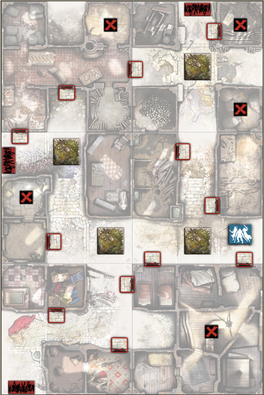

+++
title = "B1: The Dragonfiends"
tags = ["quests", "black-plague"]
draft = true
quest_difficult = "medium"
quest_survivors = 4
quest_minutes = 90
+++

*Locating a necromancers’ lair is not an easy task, and we may remember this one for a while. The cabal living here consorts with dragons. They are somewhere in the vicinity, and they’ve set vile wards to protect their haven. These are dragon bile pools, triggered by black magic as soon as anyone comes too close.*

*You can run, but you can’t hide, fiends!*

> Tiles needed: 1R, 2R, 5V, 7V, 8V & 9V.

## Objectives
- Wipe the cabal.
- Take all the Objectives.

## Special Rules
- Setting
    - Put the blue Objective randomly among the red Objectives, face down.
    - Shuffle the green Objective randomly with two red Objectives, and place them face down beside the board. This is the trap pile.
    - Place the Dragon Bile tokens at random without looking at their fire/magical barrier side.
    - Set the Dragon Bile cards apart from the Equipment pile. They are not used in this Quest.
- Necromantic assets. Each Objective gives 5 experience points to the Survivor who takes it.
- A mastercrafted weapon! When the blue Objective is taken, choose a Vault weapon, and add it to the Inventory of any Survivor.
- The dragon was obviously sick. Whenever an Actor ends a Move Action (or Move Step) in a Zone containing a Dragon Bile pool, he moves one more Zone in the same direction. If it’s impossible (T-section or having Zombies in the Zone, for example), this mandatory Move is cancelled.
- Springing the trap. Whenever an Actor (or group of Actors) ends a Move Action (or Move Step) in a Zone containing a Dragon Bile pool, and after completing or canceling the mandatory Move, draw an Objective from the trap pile. Look at it, and set it back in its pile, face down. The pile is then shuffled.
    - Red: Nothing happens.
    - Green: Flip the Dragon Bile token to the other side. A flaming side indicates a bonfire in the Zone: any Actor standing in or crossing this Zone is subject to a Dragon Fire effect. A magic barrier side means that nothing can go through or out of the Zone (lines of sight are blocked). Both effects end at the next End Phase. Reset the token to its Dragon Bile side.
