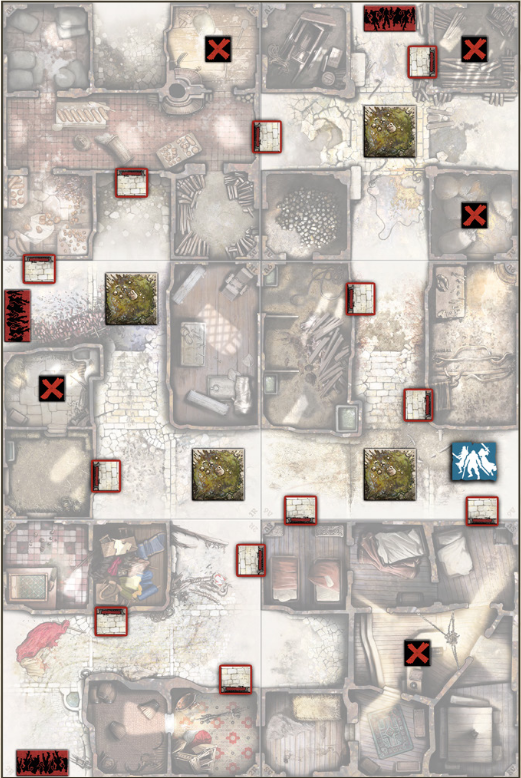

+++
title = "B1: Os Demodragões"
tags = ["quests", "black-plague"]
draft = false
quest_difficult = "medium"
quest_survivors = 4
quest_minutes = 90
+++

*Localizar o covil de um пеcromante não é uma tarefa fácil, e nós iremos nos lembrar dessa por um tempo. A cabala que vive aqui está associada com dragões. Eles estão em alzum lugar nas redondezas, e colocaram armadilhas malignas para protegerem seu refúgio, poças de bílís de dragão, atívadas por magia negra assim que alguém se aproxima demais.*

*Vocês podem correr, mas não podem se esconder, demônios!*

> Material necessário: Zombicide: Black Plague

> Mapas necessários: 1R, 2R, 5V, 7V, 8V & 9V.

## Créditos

- Tradução: Gustavo Lopes
- [Ludopedia](https://ludopedia.com.br/jogo/zombicide-black-plague/anexos/130457)
- [Fonte original](https://kairasensui.wordpress.com/2017/07/13/zombicide-black-plague-analise-e-missoes-extras/)

## Objetivos

- Eliminar a cabala.
- Pegar todos os Objetivos.

## Regras especiais

### Preparação

- Coloque o Objetivo azul aleatoriamente entre os Objetivos vermelhos, com a face virada para baixo.
- Embaralhe o Objetivo verde aleatoriamente com dois Objetivos vermelhos, e os coloque no tabuleiro com a face virada para baixo. Esta é a pilha de armadilhas.
- Coloque as fichas de Bílis de Dragão aleatoriamente sem olhar a face de Fogo/Barreira Mágica.
- Remova as cartas de Bílis de Dragão do baralho de Equipamentos. Elas não serão usadas nesta Missão.

### Posses dos necromantes

Cada Objetivo concede 5 pontos de experiência para o Sobrevivente que o pegar.

### Uma arma forjada por um mestre

Quando o Objetivo azul for pego, escolha uma carta de Cripta, e adicione ao Inventário de qualquer Sobrevivente

### O dragão está obviamente doente

Sempre que um Agente termina sua Ação de Movimento (ou Etapa de Movimento) em uma Zona contendo uma poça de Bílis de Dragão, ele anda mais uma Zona na mesma direção. Se esta Ação for impossível (seção em "T" ou caso haja Zumbis na Zona, por exemplo), este Movimento obrigatório é cancelado.

### Pulando a armadilha

Sempre que um Agente (ou grupo de Agentes) termina a Ação de Movimento (ou Etapa de Movimento) em uma Zona contendo uma u poça de Bílis de Dragão, e após completar ou cancelar o Movimento obrigatório, sorteie um Objetivo da pilha de armadilhas. Olhe e ponha de volta na pilha, com a face virada para baixo. A pilha deve ser embaralhada.

- Vermelho: Nada acontece.
- Verde: Vire a ficha de Bílis de Dragão. O lado com fogo indica uma fogueira na Zona: qualquer Agente narado na Zona ou cruzando-a está sujeito ao efeito do Fogo do Dragão. O lado com a barreira mágica significa que nada pode entrar ou sair da Zona (campo de visão é bloqueado). Ambos os efeitos terminam no fim da próxima Fase Final. Vire a ficha para o lado com a Bílis de Dragão.
