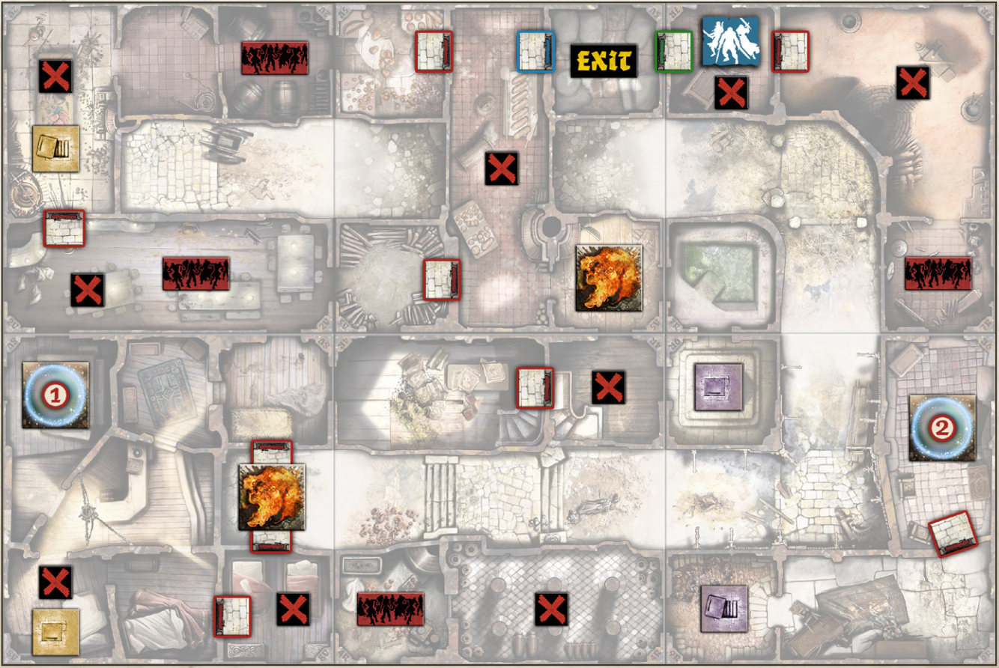

+++
title = "B2: The dark goose game"
tags = ["quests", "black-plague"]
draft = true
quest_difficult = "hard"
quest_survivors = 4
quest_minutes = 90
+++

*We found a large parchment that mentioned the “Goose Game House” and wanted to understand what it was all about. We found it, got in, and…got lost. We’ve walked through rooms, corridors, storage rooms, and workshops for two days now. It’s an enchanted maze, and to hell with whoever used to live here. We’re trapped in here with an army of zombies.*

*Or...are they trapped in here with us?*

> Tiles needed: 2V, 4R, 5V, 7R, 8V & 9R.

## Objectives
Escape! Reach the Exit Zone with all starting Survivors. Any Survivor may escape through this Zone at the end of his turn, as long as there are no Zombies in it.

## Special Rules
- Setting.
    - Put the blue and the green Objectives randomly among the red Objectives, face down.
    - Put a random Vault weapon in each Vault.
- It is a Goose Game? Each Objective gives 5 experience points to the Survivor who takes it. Keep the token on this Survivor’s ID Card. It takes no space in the Inventory.
- First rule: Cardio. Taking the green or the blue Objective gives an extra Activation to the Survivor who takes it, to be used immediately after the current one.
- Second rule: Doors. Doors do not open using the normal rules. To open a door, a Survivor spends an Action and discard an Objective token from his ID Card. In addition, the blue and the green doors can’t be opened until ALL the Objectives have been taken.
- Third rule: Vaults. Vault doors can’t be opened as usual. Instead, when an Actor (or a group of Actors) ends a Move Action or Move Step in a Zone containing an open Vault door, immediately place the Actor(s) in the corresponding Vault. This is not a Move Action. The Vault door closes behind him, and the other Vault door of the same color opens. This rule doesn’t apply when an Actor is leaving a Vault Zone.
- Fourth rule: the portal. Whenever an Actor ends a Move Action in the Zone containing the magic barrier token #1, he is teleported to the Zone containing the magic barrier token #2. This is not a Move Action and only works from #1 to #2.
- Fifth rule: Dragon Fire. An Actor suffers a Dragon Fire effect whenever he ends a Move Action in a Zone containing a Fire token.
