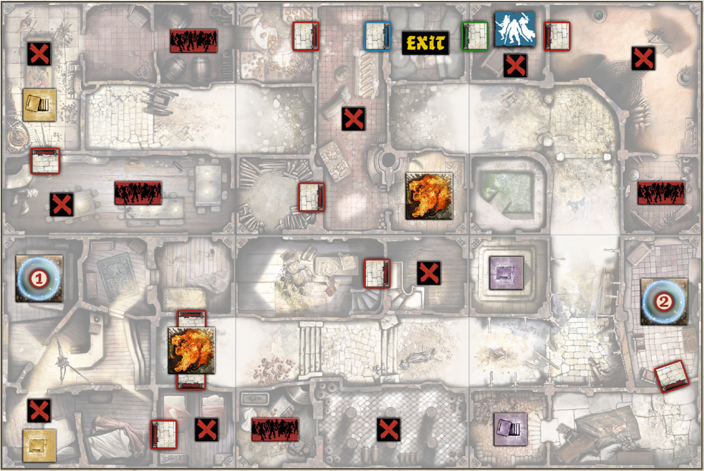

+++
title = "B2: O jogo do ganso negro"
tags = ["quests", "black-plague"]
draft = false
quest_difficult = "hard"
quest_survivors = 4
quest_minutes = 90
+++

*Nós encontramos un perzaminho enorme que mencionava a "Easa do Jogo do Ganso" e queriamos entender do que se tratava. lós a encontramos, entramos e... nos perdemos. ós andamos por salas, corredores, armazéns, e oficinas por dois dias até agora. A casa é um labirinto encantado, e nós estamos presos aqui com um exército de zumbis. Ou... será que eles estão presos aqui conosco?*

> Material necessário: Zombicide: Black Plague

> Mapas necessários: 1R, 2R, 5V, 7V, 8V & 9V.

## Créditos

- Tradução: Gustavo Lopes
- [Ludopedia](https://ludopedia.com.br/jogo/zombicide-black-plague/anexos/130457)
- [Fonte original](https://kairasensui.wordpress.com/2017/07/13/zombicide-black-plague-analise-e-missoes-extras/)

## Objetivos

**Fuja!** Chegue até a Zona de Saída com todos os Sobreviventes. Qualquer Sobrevivente pode escapar por esta Zona no final de seu turno desde que não haja Zumbis nela.

## Regras especiais

### Preparação

- Coloque os Objetivos azul e verde aleatoriamente entre Objetivos vermelhos, com a face virada para baixo.
- Coloque uma carta de Cripta aleatoriamente em cada Cripta.

### É um Jogo de Ganso?

Cada Objetivo concede 5 pontos de experiência para o Sobrevivente que o pegar. Mantenha a ficha na Planilha do Sobrevivente. Ela não ocupa espaço no Inventário.

### Primeira regra: Cardio

Pegar o Objetivo verde ou azul concede uma Ativação extra ao Sobrevivente que o pegou, que deve ser utilizada imediatamente após a atual.

### Segunda regra: Portas

Portas não abrem usando as regras normais. Para abrir uma porta, o Sobrevivente gasta uma Ação e descarta uma ficha de Objetivo de sua Planilha de Sobrevivente.

### Terceira regra: Criptas

Portas de Cripta não podem ser abertas como de costume. Ao invés, quando um Agente (ou grupo de Agentes) termina uma Ação de Movimento ou Etapa de Movimento em uma Zona contendo uma porta de Cripta aberta, imediatamente coloque o(s) Agent(es) na Cripta correspondente. Esta ação não conta como uma Ação de Movimento. Esta porta da Cripta será fechada, e a outra porta da Cripta de mesma cor será aberta. Esta regra não se aplica quando o Agente está deixando a Zona de Cripta.

### Quarta regra: o portal

Quando um Agente termina uma Ação de Movimento em uma Zona contendo a ficha de Barreira Mágica #1, ele é teleportado para a Zona contendo a ficha de Barreira Mágica #2. Esta ação não conta como uma Ação de Movimento e apenas funciona de #1 para #2.

#### Quinta regra: Fogo de Dragão

Um Agente sofre um efeito de Fogo de Dragão sempre que ele terminar uma Ação de Movimento em uma Zona contendo uma ficha de Fogo.
