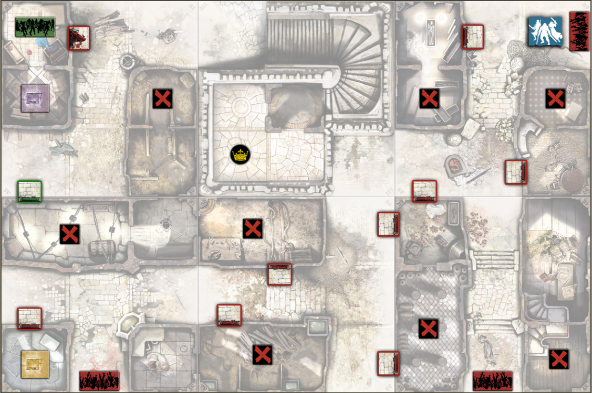

+++
title = "B3: A coroa do rei"
tags = ["quests", "black-plague", "wulfsburg"]
draft = false
quest_difficult = "medium"
quest_survivors = 4
quest_minutes = 90
+++

*Recuperar a terra das mãos dos zumbis significa unir os sobreviventes ao nosso redor. Para isso, precisamos realizar uma ação ousada e simbólica. O Rei foi derrotado e provavelmente vaga por aí em busca de carne humana. Devemos recuperar a sua coroa. É um dever sagrado! E um objeto belíssimo...*

> Materiais necessários: Zombicide: Black Plague e Zombicide: Wolfsburg

> Mapas necessários: 3V, 4R, 5R, 6V, 9V & 11V.

## Créditos

- Tradução: Neninja
- Revisão: 
- [Fonte original](https://www.zombicide.com/zombicide-fantasy-quests/)

## Objetivos

**Recupere a Coroa do Rei!** A partida é vencida assim que todos os Sobreviventes iniciais estiverem na Zona da coroa e não houver Zumbis nela.

## Regras especiais

### Preparação

- Coloque o Objetivo azul aleatoriamente entre os Objetivos vermelhos, com a face voltada para baixo.
- Coloque uma arma de Cofre aleatória em cada Cofre.
- A porta violeta do Cofre não é colocada no tabuleiro no início do jogo. Você deve encontrar o Objetivo azul primeiro (veja abaixo).

### Procurando a chave

Cada Objetivo concede 5 pontos de experiência ao Sobrevivente que o pegar.

### Uma passagem secreta!

Quando o Objetivo azul for pego, coloque a porta violeta do Cofre na sua Zona (lado fechado).

### Portas armadilha!

Resolva estes efeitos na ordem indicada sempre que a porta verde ou qualquer porta violeta do Cofre for aberta:

1. A Zona de Surgimento verde torna-se ativa.
2. Realize o surgimento de uma carta de Zumbi na Zona de Surgimento verde (ativa ou não). A Zona de Surgimento verde não pode ser removida.
