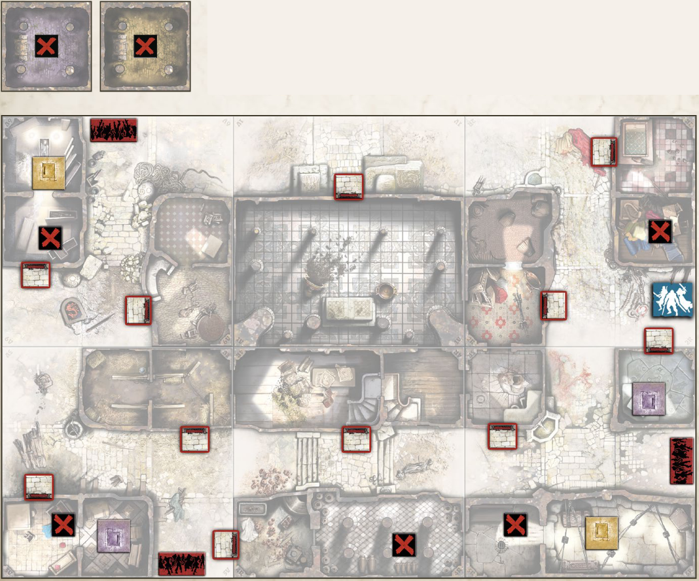

+++
title = "B4: Haunted manor"
tags = ["quests", "black-plague"]
draft = true
quest_difficult = "hard"
quest_survivors = 4
quest_minutes = 90
+++

*The manor we found was haunted long before any zombies came to ruin its glory with their rotten fingers and stinking fluid losses. The ghosts were renown for their bad tempers, and the zombie plague has sent them into unending fits of rage. It’s nothing to bother us, except that these stupid poltergeists have limited ways of showing their anger beyond throwing stuff around and slamming doors. So they slam doors continuously, which attracts zombies, which makes the ghosts even madder, and the game continues. Enough is enough! We must stop this perpetual noise. It attracts zombies from miles away, and it is really upsetting.*

> Tiles needed: 1V, 2R, 3V, 4R, 5R & 6V.

## Objectives
Purge the Zombies. You win the game as soon as there are no Zombies in the manor (the central building with six doors).

## Special Rules
- Setting:
    - Put the blue and the green Objectives randomly among five red Objectives, face down, and set them on the board as indicated.
    - Put one random Vault Weapon in each Vault.
- A gift for the spirits. Each Objective gives 5 experience points to the Survivor who takes it. Keep the token on this Survivor’s ID Card (it doesn’t occupy a slot in the Inventory).
- You aren’t welcome. No one is. The six manor doors can’t be opened by regular means.
- Angry spirits. Each time an Objective is taken, roll a die: open the manor door located on the tile with the corresponding number, and Spawn Zombies in the whole building even if a Zombie spawn was resolved after a previous door opening. Zombies inside don’t Move during Move Steps unless a Survivor has entered the manor.
- Sooth the spirits. At anytime during the Survivors’ Phase, the whole team can discard five double-sided red Objectives OR one blue and one green Objective to open all manor doors. Spawn Zombies in the whole building even if a Zombie spawn was resolved after a previous door opening. Zombies inside don’t Move during Move Steps until a Survivor has entered the manor.
- Ghosts slamming doors, again. Before each Zombies’ Phase, close all opened manor doors. If the doors are opened again, Spawn inside the building as if no door had been opened previously.
