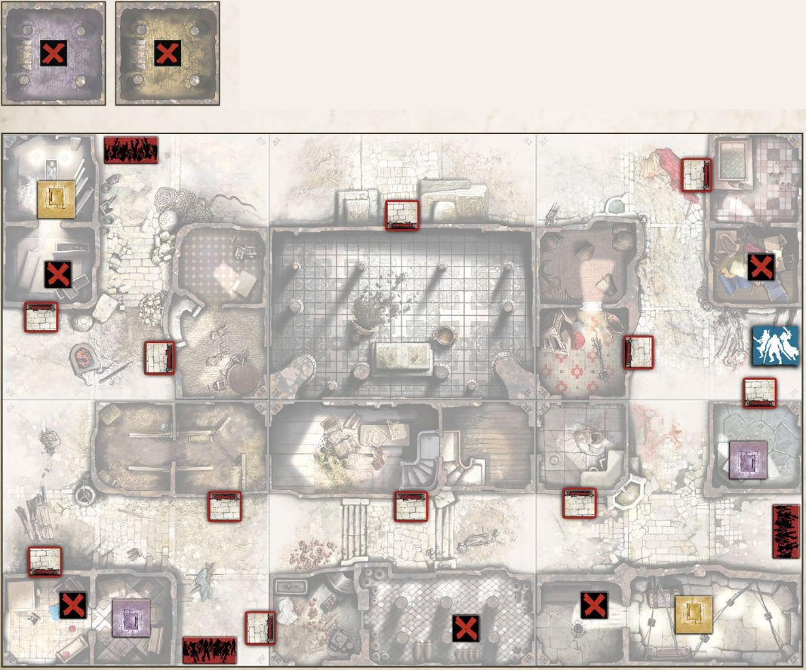

+++
title = "B4: Mansão assombrada"
tags = ["quests", "black-plague"]
draft = false
quest_difficult = "hard"
quest_survivors = 4
quest_minutes = 90
+++

*A mansão que encontramos estava assombrada desde muito antes dos zumbis aparecerem para acabar com sua glória, com seus dedos podres e fluidos fedorentos. Os fantasmas eram renomados por seus temperamentos ruins e a praga dos zumbis os colocou em um estado de fúria incansável. Eles não deveriam ser um incômodo, exceto pelo fato de que estas aparições estúpidas possuem formas limitadas de mostrar sua raiva além de jogar objetos por aí e bater portas. Batendo portas sem parar, eles atraem mais zumbis, se enfurecem e assim por diante. Chega é chega! Nós precisamos parar este barulho interminável, que está atraindo zumbis a quilômetros de distância.*

> Material necessário: *Zombicide: Black Plague*

> Mapas necessários: 1V, 2R, 3V, 4R, 5R & 6V.

## Créditos

- Tradução: Gustavo Lopes
- [Ludopedia](https://ludopedia.com.br/jogo/zombicide-black-plague/anexos/130457)
- [Fonte original](https://kairasensui.wordpress.com/2017/07/13/zombicide-black-plague-analise-e-missoes-extras/)
- Edição e revisão: Neninja

## Objetivos

**Elimine todos os Zumbis.** Você vence o jogo caso todos os Zumbis dentro da mansão (prédio central com seis portas) sejam eliminados.

## Regras especiais

### Preparação

- Coloque os Objetivos azul e verde aleatoriamente entre os cinco Objetivos vermelhos, com a face virada para baixo.
- Coloque uma carta de Cripta aleatoriamente em cada Cripta.

### Um presente para os espíritos

Cada Objetivo concede 5 pontos de experiência para o Sobrevivente que o pegar. Mantenha a ficha na Planilha do Sobrevivente. Ela não ocupa espaço no Inventário.

### Você não é bem-vindo. Ninguém é

As seis portas da mansão não podem ser abertas por meios comuns.

### Espíritos furiosos

Sempre que um Objetivo for pego, role um dado: abra a porta da mansão localizada na área do mapa correspondente ao número, e sorteie Zumbis para a mansão inteira mesmo que Zumbis já tenham sido sorteados como resultado da abertura de outra porta. Zumbis dentro da mansão não se movem durante a Etapa de Movimento a menos que um Sobrevivente tenha entrado na mansão.

### Acalme os espíritos

A qualquer momento durante a Fase dos Sobreviventes, o time inteiro pode descartar cinco Objetivos vermelhos OU um azul e um verde para abrir todas as portas da mansão. Sorteie Zumbis para a mansão inteira mesmo que Zumbis já tenham sido sorteados como resultado da abertura de outra porta. Zumbis dentro da mansão não se movem durante a Etapa de Movimento a menos que um Sobrevivente tenha entrado na mansão.

### Fantasmas batendo portas, de novo

Antes de cada Fase de Zumbis, feche todas as portas da mansão. Se as portas forem abertas novamente, sorteie Zumbis para o interior da mansão como se nenhuma porta tivesse sido aberta anteriormente.
