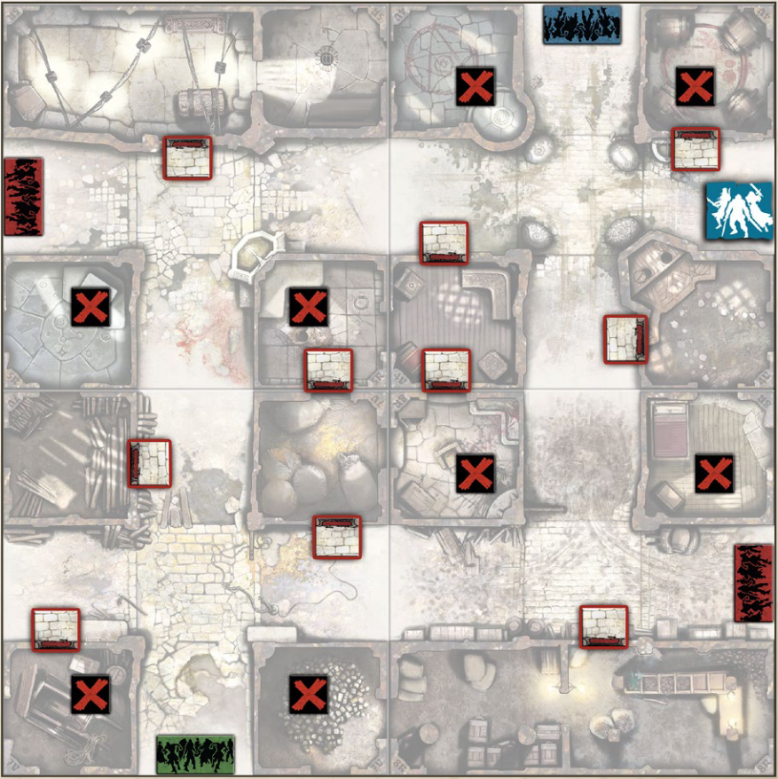

+++
title = "B5: Hush!"
tags = ["quests", "black-plague"]
draft = true
quest_difficult = "hard"
quest_survivors = 4
quest_minutes = 90
+++

*We're out to explore what remains of the richest district in this city, but there are huge zombie herds all around the place. There are too many of them for us to kill, so we’d better get in and out as quietly as possible, preferably without being seen. It won’t be easy…*

> Tiles needed: 4V, 5R, 7V & 8R.

## Objectives
Explore. Take all Objectives.

## Special Rules
- Exploration reward. Each Objective gives 5 experience points to the Survivor who takes it.
- At least there’s nothing to worry on this side. The blue and green Spawn Zones are inactive during Spawn Steps. They are still affected by the “Drawing Attention” special rule.
- Drawing attention. Whenever a Survivor ends his Turn with a Line of Sight to one or more Spawn Zones, immediately draw a Zombie card for these Spawn Zones, no matter
the Zombie tokens’ color, type, or status.
