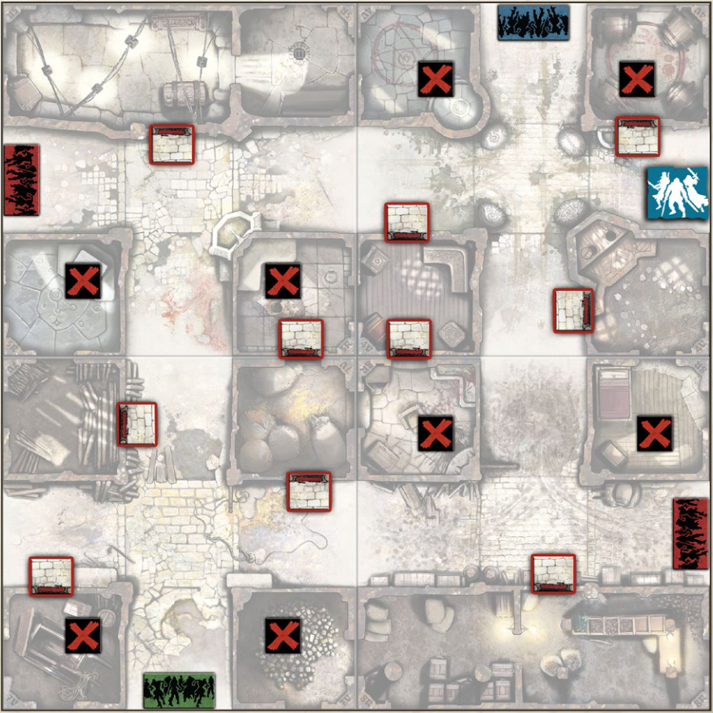

+++
title = "B5: Silêncio!"
tags = ["quests", "black-plague"]
draft = false
quest_difficult = "hard"
quest_survivors = 4
quest_minutes = 90
+++

*Nós estamos fora para explorar o que restou do distrito mais rico desta cidade, mas há enormes hordas de zumbis por todo o lugar. São zumbis demais para nós enfrentarmos, portanto, é melhor entrar e sair o mais silenciosamente possível, de preferência sem sermos vistos. Não será fácil...*

> Materiais necessários: Zombicide: Black Plague

> Mapas necessários: 4V, 5R, 7V & 8R

## Créditos

- Tradução: Gustavo Lopes
- [Ludopedia](https://ludopedia.com.br/jogo/zombicide-black-plague/anexos/130457)
- [Fonte original](https://kairasensui.wordpress.com/2017/07/13/zombicide-black-plague-analise-e-missoes-extras/)

## Objetivos
**Explore.** Pegue todos os Objetivos.

## Regras especiais

### Recompensa de exploração

Cada Objetivo concede 5 pontos de experiência para o Sobrevivente que o pegar.

### Pelo menos não há nada para se preocupar deste lado

As Zonas de Entrada de Zumbis azul e verde estão inativas durante a Etapa de Entrada de Zumbis. Elas ainda assim são afetadas pela regra especial "Chamando atenção".

### Chamando atenção

Quando um Sobrevivente termina seu Turno na Linha de Visão de uma ou mais Zonas de Entrada de Zumbis, imediatamente sorteie uma carta de Zumbis para estas Zonas de Entrada.
