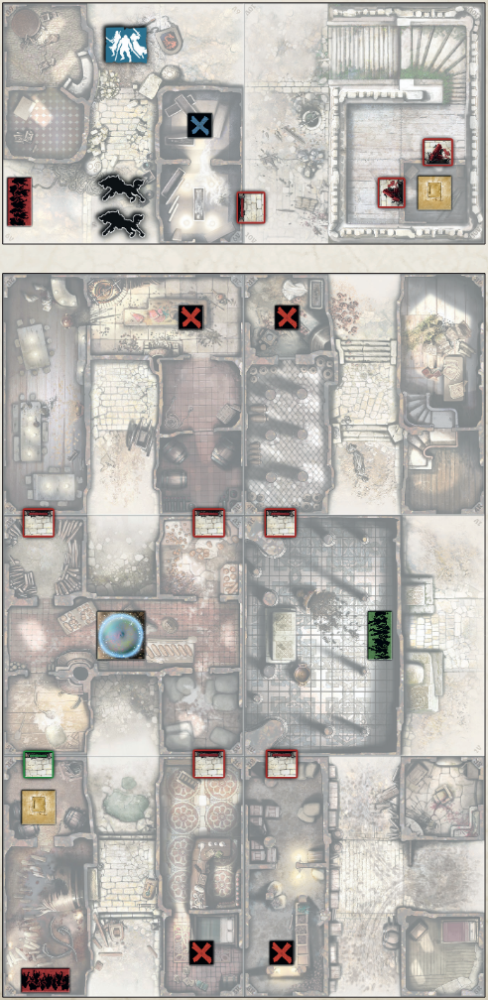

+++
title = "B58: The dungeon of famine!"
tags = ["quests", "black-plague", "wulfsburg"]
draft = true
quest_difficult = "very hard"
quest_survivors = 6
quest_minutes = 60
+++

> By Henrique GARRIGÓS, Rodrigo SONNESSO, and Toi VON GLEHN.

*Legend says that the Dungeon of Famine holds great treasures and secrets long forgotten. Captain Ardgeel went inside by himself and hasn’t returned. We cannot let his greed cause his doom, for true friends value each other despite their flaws. We are rushing towards this evil place, hoping that the captain is safe somewhere inside. No man can withstand the malevolent aura that emanates from it for long!*

> Tiles: 1V, 2V, 3R, 4R, 5V, 6V, 8R, & 10V.

## Objectives
Rescue Captain Ardgeel! Find the Green Objective and bring it to the Magic Dome Zone.

## Special Rules
- Setup.
    - The board has 2 separate levels as shown on the map. Both levels are connected by the Yellow Vault token. Once open, any Survivor may spend a Move Action to move from one level to another.
    - Set aside a Survivor Dashboard with its Danger Bar set to 9. It represents the dungeon timer.
    - Shuffle the Green Objectives among the Red Objectives, facedown.
    - Place the Blue Objective as indicated on the map.
- Aura of Famine. At the end of each Game Round, decrease the dungeon timer by 1. When the timer reaches 6, then 3, every Survivor outside the Magic Dome Zone endures 1 Wound. When the dungeon timer reaches 0, Captain Ardgeel perishes and the Quest is lost.
- As above, so below. A board level is inactive if there are no Survivors on it during the Zombies’ Phase. Zombies on that level do not activate. Do not draw Zombie cards for its active Spawn Zones.
- Your friend is in another room. Red Objectives give 5 Experience Points to the Survivor who takes it.
- Lucky. The Blue Objective gives 5 Experience Points to the Survivor who takes it. Then, the Survivor obtains a random Vault Weapon. They can then reorganize their inventory for free.
- I found Ardgeel! The Green Objective gives 5 Experience Points to ALL Survivors when taken. Keep this Objective next to the Survivor’s dashboard. It doesn’t take up a slot in their inventory and may be traded like an Equipment card. The Green Spawn Zone is inactive until the Green Objective is taken.
- Fragile doors. Die rolls to open doors automatically succeed.
- Too many horrors. Whenever Zombies would split into new groups when moving, do not add new Zombies to the map. In this case, players choose where the extra Zombie moves to instead.
