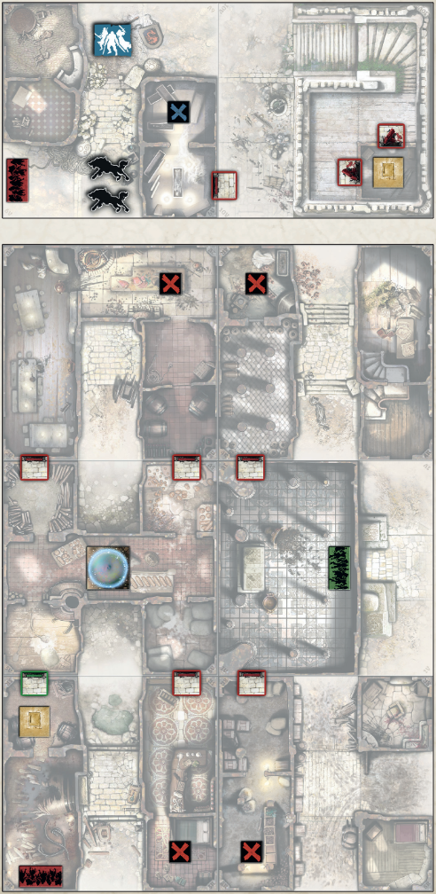

+++
title = "B58: A masmorra da fome!"
tags = ["quests", "black-plague", "wulfsburg"]
draft = false
quest_difficult = "very hard"
quest_survivors = 6
quest_minutes = 60
+++

> By Henrique GARRIGÓS, Rodrigo SONNESSO, and Toi VON GLEHN.

*Diz a lenda que a Masmorra da Fome guarda grandes tesouros e segredos há muito esquecidos. O Capitão Ardgeel entrou sozinho e não retornou. Não podemos permitir que a ganância dele o leve à ruína, pois verdadeiros amigos valorizam uns aos outros, apesar de suas falhas. Apressamo-nos em direção a esse lugar maligno, esperando que o capitão esteja a salvo em algum ponto lá dentro. Nenhum homem consegue suportar por muito tempo a aura malévola que emana de lá!*

> Materiais necessários: Zombicide: *Black Plague* e *Zombicide: Wolfsburg*

> Mapas necessários: 1V, 2V, 3R, 4R, 5V, 6V, 8R, & 10V.

## Créditos

- Tradução: Neninja
- [Fonte original](https://www.zombicide.com/zombicide-fantasy-quests/)
- Edição e revisão: Neninja

## Objectivos
**Resgate o Capitão Ardgeel!** Encontre o Objetivo Verde e leve-o para a Zona da Cúpula Mágica.

## Special Rules

### Preparação
- O tabuleiro possui 2 níveis distintos, conforme mostrado no mapa. Ambos os níveis estão conectados pelo marcador de Cofre Amarelo. Uma vez aberto, qualquer Sobrevivente pode gastar uma Ação de Movimento para ir de um nível para o outro. 
- Separe um Painel de Sobrevivente com sua Barra de Perigo ajustada para 9. Ele representa o cronômetro da masmorra. 
- Embaralhe os Objetivos Verdes junto com os Objetivos Vermelhos, com as faces voltadas para baixo. 
- Coloque o Objetivo Azul conforme indicado no mapa.

### Aura de Fome

Ao final de cada Rodada de Jogo, reduza o cronômetro da masmorra em 1. Quando o cronômetro chegar a 6 e, depois, a 3, todo Sobrevivente fora da Zona da Cúpula Mágica sofre 1 Ferimento. Quando o cronômetro da masmorra chegar a 0, o Capitão Ardgeel perece e a Missão é perdida.

### Assim em cima, como embaixo

Um nível do tabuleiro fica inativo se não houver Sobreviventes nele durante a Fase dos Zumbis. Zumbis nesse nível não são ativados. Não compre cartas de Zumbi para suas Zonas de Surgimento ativas.

### Seu amigo está em outra sala

Objetivos Vermelhos concedem 5 Pontos de Experiência ao Sobrevivente que os pegar.

### Sortudo

O Objetivo Azul concede 5 Pontos de Experiência ao Sobrevivente que o pegar. Em seguida, o Sobrevivente obtém uma Arma de Cofre aleatória. Ele pode então reorganizar seu inventário gratuitamente.

### Encontrei Ardgeel!

O Objetivo Verde concede 5 Pontos de Experiência a TODOS os Sobreviventes quando é pego. Mantenha esse Objetivo próximo ao painel do Sobrevivente. Ele não ocupa um espaço no inventário e pode ser trocado como uma carta de Equipamento. A Zona de Surgimento Verde permanece inativa até que o Objetivo Verde seja pego.

### Portas frágeisl

Testes de dado para abrir portas são bem-sucedidos automaticamente.

### Horrores demais

Sempre que Zumbis fossem se dividir em novos grupos ao se mover, não adicione novos Zumbis ao mapa. Nesse caso, os jogadores escolhem para onde o Zumbi extra se move.
